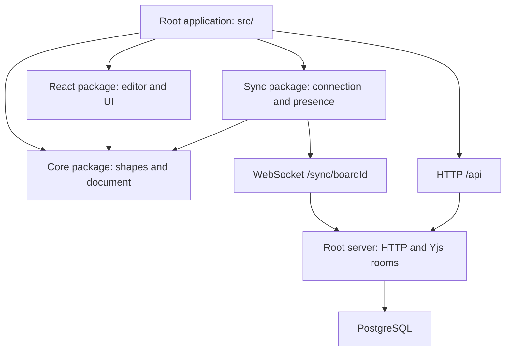

# Architecture and code map

[Documentation home](README.md) · [Core](core.md) · [React](react.md) · [Synchronization](sync.md) · [Server](server.md)

## Package boundaries



| Layer | Owns | Does not choose |
| --- | --- | --- |
| `@kritzlboard/core` | Shape/style types, geometry, connector layout, Yjs document, local undo | React UI, network URL, user identity, database |
| `@kritzlboard/react` | SVG and HTML rendering, camera, tools, selection, gestures, controls, React subscriptions | Routes, account UI, document persistence, server deployment |
| `@kritzlboard/sync` | Provider connection, awareness, remote peer snapshots, connection status | Product user lookup, environment variables, PostgreSQL access |
| Root application | Navigation, auth client, identity/preferences, recents, store/connection ownership | Geometry or duplicated canvas implementation |
| Root server | Auth endpoints, board bookmarks, live rooms, snapshots, migrations, static hosting | React editor state or browser layout |

The pnpm workspace includes `packages/*`. The root application consumes compiled package exports. The server has a separate `server/package.json` for its container runtime dependencies, but is not a named workspace package. An `@kritzlboard/server` package and a separate application package are possible future extractions, not part of the current code.

## Data and ownership

| State | Location | Lifetime and sharing |
| --- | --- | --- |
| Shapes | Core store's Yjs `shapes` map | Shared when a transport synchronizes the document; server snapshots persist them |
| Board name | Yjs `meta` map | Shared document metadata; not part of shape undo history |
| Shape undo/redo | Core store's `Y.UndoManager` | Tracks local shape transactions; not a shared history or persisted undo log |
| Camera, active tool, selection | React board controller | Local to one provider/editor instance |
| In-board copy/cut/paste buffer | React controller ref | Local to that editor instance; not OS clipboard document exchange |
| Current style defaults | React controller; optionally host preferences | Local to an editor; new shapes carry their chosen style as document data |
| Cursor and selected shape IDs for peers | Awareness | Temporary presence, separate from persistent document updates |
| Connection status | Sync adapter/provider | Transport state; not an initial-sync or database-durability acknowledgement |
| Account and sessions | Auth client plus server auth tables | Product authentication, independent of local anonymous presence identity |
| Anonymous identity, styles, recents | Browser localStorage | Device/browser preferences and metadata, not drawing persistence |
| Signed-in recent-board list | `user_boards` table | Account bookmarks, not board authorization |

### Store ownership

The core store constructor creates a document. Its owner calls `destroy()` when that document is no longer needed. A React `Board` receives a store and does not destroy it.

The package's `useBoardStore(boardId)` hook is one convenient owner: it creates the store in an effect and destroys it during cleanup. Consumers handle its initial `null` result.

The root application's [store adapter](../src/board/store.ts) extends the core store and creates a `BoardConnection` using the browser origin and current identity. Its `destroy()` first destroys the connection, then the document. The board route owns this adapter.

A connection manages its provider/awareness resources, not the supplied core store. Destroy the connection before its document.

Two React providers can share one core store. They have independent editor state but shared shapes, title, and undo history. Two different stores with the same ID remain separate until a transport connects them.

## Application startup and board navigation

1. [`src/main.tsx`](../src/main.tsx) imports application and board styles, creates the router, and mounts it under React Strict Mode.
2. [`src/router.tsx`](../src/router.tsx) uses the generated file-route tree with intent preloading and scroll restoration.
3. [The home route](../src/routes/index.tsx) creates a new board ID with `nanoid(10)` and navigates to `/b/<id>`. There is no separate create-board HTTP endpoint in this flow.
4. [The board route](../src/routes/b.$boardId.tsx) loads `/api/config`. If the instance requires auth, it checks the session and redirects to login when necessary.
5. After the route mounts, its effect creates the application store and starts its connection.
6. [The application Board](../src/board/Board.tsx) renders the package's `Board` with saved style preferences, connection-as-presence, and the application `TopBar`.
7. The route effect destroys its store on unmount or ID change. A board-ID guard prevents a previous document from being displayed while the next store is being created.

The client config helper falls back to `requireAuth: false` if the config request fails. That permits the UI to continue when the server is unavailable; it does not override the server's WebSocket authentication gate.

## An edit from pointer to persistence

```mermaid
sequenceDiagram
  participant UI as React controller
  participant Store as Core BoardStore
  participant Sync as BoardConnection
  participant Room as Server room
  participant DB as PostgreSQL
  UI->>Store: putShape / putShapes / deleteShapes
  Store->>Store: Local Yjs transaction and snapshot invalidation
  Store-->>UI: Notify subscribers; render new snapshot
  Store-->>Sync: Yjs update
  Sync->>Room: y-websocket sync message
  Room-->>Sync: Broadcast updates to room clients
  Room->>Room: Mark dirty and schedule snapshot save
  Room->>DB: Upsert full encoded Yjs state
```

The local document is the immediate source for rendering. A browser can continue changing that document while disconnected; synchronization can send changes after reconnecting while that document remains alive. Reloading an offline page loses unsent in-memory changes because the application has no browser document persistence layer.

The server coalesces changes using a 1,200 ms timer started by the first update in a pending batch. It serializes saves per room. A connected status only reports the WebSocket state; the UI does not receive a per-edit PostgreSQL save acknowledgement.

## Shapes and concurrent changes

Shapes are plain object values in a Yjs map keyed by shape ID. The model supports `rect`, `ellipse`, `line`, `arrow`, `draw`, and `text`. Drawing order is stored on each shape.

Yjs merges document operations between replicas. A shape object is a map value, not a nested Yjs map for every field. Do not assume independent concurrent changes to two properties of the same shape will be merged field by field.

Core store methods group local writes and connector adjustments into transactions. They also identify a local transaction origin so shape undo can exclude remote edits. Board-name changes belong to metadata and are not undone through the shape history.

Store getters cache shape arrays for external-store subscriptions. Treat the returned arrays and shape values as immutable even though they are not frozen. Replace shapes with store methods; mutating a returned object bypasses notification and synchronization.

## Connector layout

Lines and arrows can bind their start or end to another shape, with optional normalized anchors. The core geometry layer calculates attachment positions, hit areas, bounding boxes, and transforms.

Local store writes update bound connectors transactionally. When remote updates arrive, the rendered store snapshot also resolves connectors without writing derived geometry back into the shared document. Consequently, `getShapes()` can contain resolved endpoint positions that differ from raw `yShapes` values.

Use the store's public snapshot for rendering, and read the [core geometry reference](core.md) before changing connector behavior. Low-level mutation of raw Yjs maps is an integration escape hatch, not a substitute for normal editing methods.

## React rendering and interaction flow

| Module | Responsibility |
| --- | --- |
| [`context.tsx`](../packages/react/src/context.tsx) | Connects a provider to its controller and exposes editor context |
| [`useBoardController.ts`](../packages/react/src/useBoardController.ts) | Editor state, pointer sessions, keyboard/wheel handling, camera, selection, duplication, text editing, presence publication |
| [`Board.tsx`](../packages/react/src/Board.tsx) | Ready-made composition and public root/control wrappers |
| [`BoardCanvas.tsx`](../packages/react/src/BoardCanvas.tsx) | Grid, world transform, ordered shapes, overlays, and HTML text editor |
| [`ShapeView.tsx`](../packages/react/src/ShapeView.tsx) | Shape SVG rendering, freehand outline, labels, optional fade/hide-label |
| [`SelectionOverlay.tsx`](../packages/react/src/SelectionOverlay.tsx) | Local/remote selection visuals, resize handles, brush selection |
| [`BindingOverlay.tsx`](../packages/react/src/BindingOverlay.tsx) | Connector attachment preview |
| [`PeerCursors.tsx`](../packages/react/src/PeerCursors.tsx) | Remote cursors and labels |
| [`TextEditor.tsx`](../packages/react/src/TextEditor.tsx) | HTML contenteditable overlay positioned over an SVG shape |
| [`hooks.ts`](../packages/react/src/hooks.ts) | Store ownership and React external-store subscriptions |
| [`styles.css`](../packages/react/src/styles.css) | Package-local classes and theme variables |

The canvas uses `scale(z) translate(-x, -y)` for world coordinates. Pointer positions subtract the canvas's bounding rectangle before conversion into world coordinates. Container resizing preserves the world position at the visible center.

Keyboard handling is attached to the board root, skips editable fields, and checks the closest board root to prevent nested boards handling one another's events. This is why host inputs and independent boards can coexist.

Text input uses an HTML overlay rather than SVG editing. Standalone text is temporarily hidden beneath its editor; other shapes stay visible with their label hidden. Empty standalone text is removed on finish, while an empty shape label is allowed. Rectangles and ellipses can grow to fit label height.

## Server room lifecycle

The backend applies SQL migrations before listening. It creates rooms lazily on connection, deduplicates simultaneous loads for a room ID, and loads its saved Yjs snapshot from PostgreSQL. Legacy `.yjs` files may be imported when no current row exists.

Each room owns its document, awareness, clients, save state, and timers. The server exchanges standard y-websocket sync and awareness messages. A 30-second heartbeat detects unresponsive sockets. When the last client leaves, it attempts a final save and unloads the room if it remains empty.

Persistence errors are logged. A save failure marks the room dirty but does not independently schedule another retry; last-client cleanup can unload it even after a failed save. Room-load failures also do not currently abort the room join. Review the [server reference](server.md) before changing these failure paths or relying on stronger durability.

SIGINT and SIGTERM trigger saves for loaded rooms, close the database pool, and exit. This is not a full traffic-draining shutdown protocol. Rooms are process-local, and PostgreSQL snapshots are not a cross-process message bus.

## Product code map

| Module | Responsibility |
| --- | --- |
| [`src/routes/__root.tsx`](../src/routes/__root.tsx) | Route outlet and not-found view |
| [`src/routes/index.tsx`](../src/routes/index.tsx) | Home page, new IDs, merged recent boards, account corner |
| [`src/routes/login.tsx`](../src/routes/login.tsx) | Sign-in/sign-up form and return navigation |
| [`src/routes/b.$boardId.tsx`](../src/routes/b.$boardId.tsx) | Auth gate and application-store lifecycle |
| [`src/board/Board.tsx`](../src/board/Board.tsx) | Embedding composition and local style preference |
| [`src/board/TopBar.tsx`](../src/board/TopBar.tsx) | Board title, identity, peer avatars, status, sharing, bookmark recording |
| [`src/board/store.ts`](../src/board/store.ts) | Product URL/user policy, connection ownership, status hook |
| [`src/lib/auth-client.ts`](../src/lib/auth-client.ts) | Better Auth client and server-config request |
| [`src/lib/boards.ts`](../src/lib/boards.ts) | Signed-in recent-board HTTP helpers |
| [`src/lib/user.ts`](../src/lib/user.ts) | Local identity, recents, and legacy browser-key migration |
| [`src/components/ui/button.tsx`](../src/components/ui/button.tsx) | Product button variants and Radix slot composition |
| [`src/lib/utils.ts`](../src/lib/utils.ts) | Tailwind-aware class merging |
| [`src/styles.css`](../src/styles.css) | Product theme, font imports, and full-screen board container |

See [Application guide](application.md) for behavior and helper contracts, [Hooks](hooks.md) for lifecycles, and [Development](development.md) for build, test, and extension workflows.

